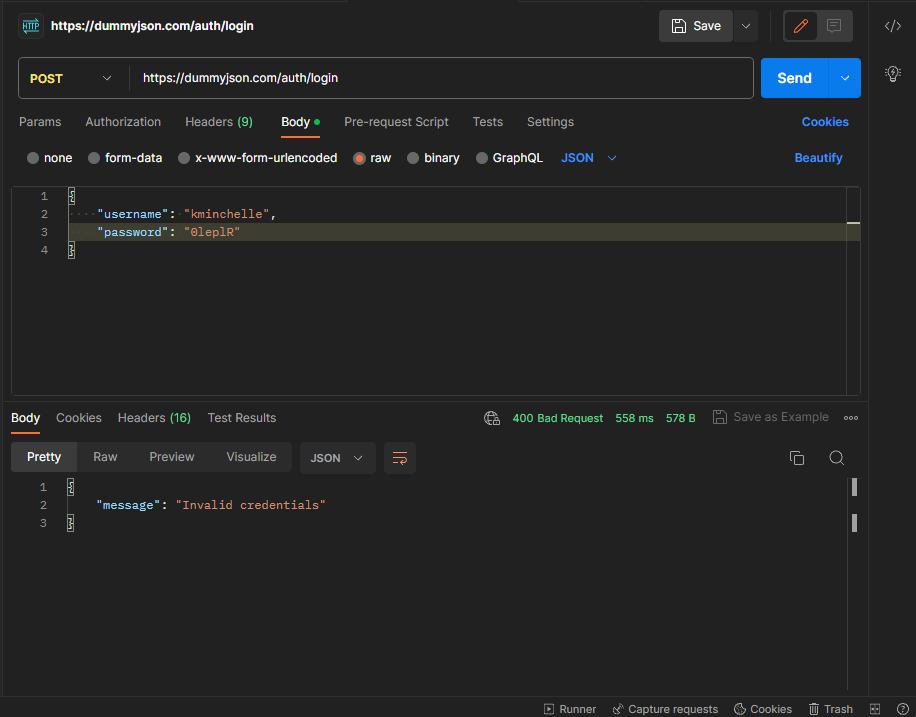

# Automation DBC

Automação criada para desafio tecnico da DBC Company.

## Inicializar Projeto

1. npm i cypress = Instalar cypress;
2. npm i = Instalar as dependencias;
3. npm test = Realizar testes do cypress em headless ou npx cypress open = realizar testes com interface grafica.

## Bugs

1. Corrigir endpoint 'products/add', status code divergente da documentação. Alterar de 201, para 200.
2. Corrigir endpoint 'products/{id}', status code divergente da documentação. Alterar de 404, para 401. OBS: Cenario fail.

## Melhorias

1. No endpoint 'products/add', restringir para apenas letras e numeros o campo 'title' para prevenir problemas com performance;
 1.1 No mesmo endpoint restringir para apenas 250 caracteres o campo description, para prevenir problemas com perfomance.
2. No endpoint 'auth/login' adicionar a documentação response 400 -invalid credentials;

## Estrategia

1. A estrategia realizada foi deixar o codigo mais clean, pratico e otimizado possivel. Optei por desempenho, mas preferiria realizar automações pelo postman para obter mais desempenho;
 1.1 Usufri da documentação para deixar o fluxo mais simples possivel.